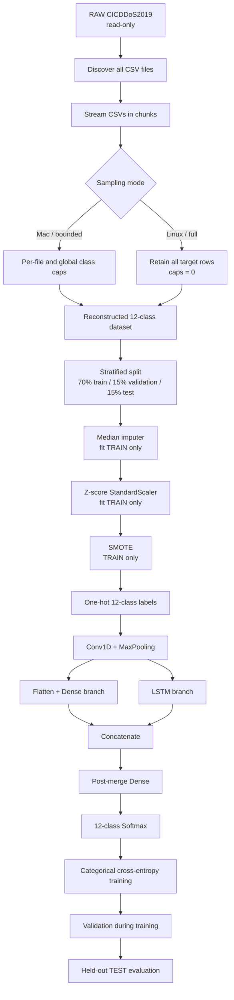

<div align="center">

# [CNN-LSTM-DDoS-Detection-CICDDoS2019.](https://github.com/BrenoFariasdaSilva/CNN-LSTM-DDoS-Detection-CICDDoS2019) 

</div>

<div align="center">

---

**Methodology source:** Deepak Singh Rajput and Arvind Kumar Upadhyay, *Enhanced Network Defense: Optimized Multi-Layer Ensemble for DDoS Attack Detection* (2024), DOI: [10.52756/ijerr.2024.v46.020](https://doi.org/10.52756/ijerr.2024.v46.020).

A reproducible, memory-aware implementation of the paper's 12-class CICDDoS2019 CNN-LSTM experiment, organized as a modular Python project for Apple Silicon and Linux GPU servers. This repository is an independent reproduction and is not an official repository of the paper's authors.

---

</div>

<div align="center">


</div>

<div align="center">
  


</div>

## Table of Contents

- [CNN-LSTM-DDoS-Detection-CICDDoS2019. ](#cnn-lstm-ddos-detection-cicddos2019-)
  - [Table of Contents](#table-of-contents)
  - [Introduction](#introduction)
  - [Original Paper](#original-paper)
  - [Reproduction Objective](#reproduction-objective)
  - [Paper Methodology and Project Mapping](#paper-methodology-and-project-mapping)
  - [Pipeline](#pipeline)
  - [Target Classes](#target-classes)
  - [CNN-LSTM Architecture](#cnn-lstm-architecture)
  - [Dataset Handling and Sampling](#dataset-handling-and-sampling)
    - [Read-only source protection](#read-only-source-protection)
    - [Bounded Mac mode](#bounded-mac-mode)
    - [Full Linux mode](#full-linux-mode)
  - [Project Structure](#project-structure)
  - [Requirements](#requirements)
  - [Setup](#setup)
    - [Clone the repository](#clone-the-repository)
  - [Makefile Automation](#makefile-automation)
  - [Installation and Execution](#installation-and-execution)
    - [macOS Apple Silicon — bounded-memory execution](#macos-apple-silicon--bounded-memory-execution)
    - [Linux SSH server — full-source execution](#linux-ssh-server--full-source-execution)
  - [Runtime Logging and Completion Sound](#runtime-logging-and-completion-sound)
  - [Configuration](#configuration)
  - [Generated Outputs](#generated-outputs)
  - [Reproducibility Notes and Limitations](#reproducibility-notes-and-limitations)
  - [Results Target](#results-target)
  - [References](#references)
  - [How to Cite](#how-to-cite)
  - [Contributing](#contributing)
  - [Author](#author)
  - [License](#license)
    - [MIT License](#mit-license)

## Introduction

This repository reconstructs the **12-class CICDDoS2019 CNN-LSTM experiment** described by Deepak Singh Rajput and Arvind Kumar Upadhyay in *Enhanced Network Defense: Optimized Multi-Layer Ensemble for DDoS Attack Detection*.

The paper compares a hybrid machine-learning approach with a CNN-LSTM deep-learning architecture. The paper reports **99.84% accuracy for binary classification** and **99.76% accuracy for the 12-class multiclass task**. This project targets the multiclass CNN-LSTM result because it is the more demanding experiment and corresponds to the `PAPER_TARGET_ACCURACY = 0.9976` configured in the implementation.

The goal is **reproduction, not retrospective redesign**. Settings explicitly reported by the paper are retained wherever they are available. Missing details are implemented as explicit, inspectable reconstruction choices rather than being hidden. The raw CICDDoS2019 corpus is treated as read-only, and all generated artifacts remain inside the project output directory.

## Original Paper

> D. S. Rajput and A. K. Upadhyay, “Enhanced Network Defense: Optimized Multi-Layer Ensemble for DDoS Attack Detection,” *International Journal of Experimental Research and Review*, vol. 46, pp. 253–272, 2024. DOI: [10.52756/ijerr.2024.v46.020](https://doi.org/10.52756/ijerr.2024.v46.020).

The paper uses CICDDoS2019 and proposes a CNN-LSTM model in which convolutional layers perform spatial/feature extraction and LSTM layers model sequential dependencies. The publication reports the CNN-LSTM as the strongest deep-learning approach, with the multiclass experiment reaching **99.76% accuracy**.

## Reproduction Objective

The repository reproduces the paper's best **12-class multiclass CNN-LSTM** path as closely as the publication permits. It is designed to answer four practical questions:

1. Can the reported preprocessing and CNN-LSTM methodology be implemented end-to-end on CICDDoS2019?
2. How close can an independent execution get to the paper's 99.76% multiclass accuracy?
3. Which experiment details are directly supported by the publication, and which have to be reconstructed?
4. Can the same code run in constrained Apple-Silicon memory and in a high-memory Linux GPU server without changing the experiment logic?

## Paper Methodology and Project Mapping

The paper describes a hybrid CNN-LSTM detector for CICDDoS2019. This implementation maps that methodology to an auditable pipeline while preserving training/test separation for preprocessing and SMOTE.

| Stage | Paper/reproduction intent | Implementation in this repository |
| --- | --- | --- |
| Dataset | CICDDoS2019 | Recursively discovers source CSV files under `--data-dir`; source files are read-only. |
| Multiclass task | 12-class DDoS classification | Uses the reconstructed 12-class mapping shown below. |
| Data ingestion | Large CICDDoS2019 flow corpus | Reads CSVs in configurable chunks instead of loading the raw corpus at once. |
| Sampling | Publication does not provide a complete reproducible sampling recipe | Supports bounded per-file/per-class sampling or full uncapped retention with `0`. |
| Split | Training, validation and test evaluation | Stratified `70% / 15% / 15%` split. |
| Missing values | Clean/preprocess traffic records | Median imputation is fit on the training split only, then applied to validation/test. |
| Standardization | Normalized model inputs | Z-score `StandardScaler` is fit on training only and reused for validation/test. |
| Class imbalance | SMOTE | Classic multiclass SMOTE is applied **only to the standardized training split**. |
| Deep feature extraction | CNN | One or two `Conv1D` stages followed by max pooling. |
| Temporal/sequence modeling | LSTM | LSTM receives the CNN feature maps. |
| Parallel representation | Hybrid architecture | CNN output also feeds a parallel flattened Dense branch. |
| Fusion | Combined learned features | Dense and LSTM branches are concatenated. |
| Classification | Multiclass Softmax | Final Dense Softmax over 12 reconstructed classes. |
| Loss | Multiclass optimization | Categorical cross-entropy. |
| Evaluation | Accuracy and class-level performance | Held-out test metrics, confusion matrix, classification report, and predictions. |

A crucial implementation rule is that **validation and test data never participate in SMOTE**, and both the imputer and scaler are fit using the training split only.

## Pipeline



The same sequence in compact form is:

```text
RAW CICDDoS2019
→ chunked ingestion
→ bounded or full target-row retention
→ 70/15/15 stratified split
→ TRAIN-fitted median imputation
→ TRAIN-fitted z-score standardization
→ TRAIN-only SMOTE
→ one-hot labels
→ CNN
→ parallel Dense + LSTM
→ concatenation
→ Dense
→ 12-class Softmax
→ categorical cross-entropy
→ validation
→ held-out test evaluation
```

## Target Classes

The publication states a 12-class task but does not provide every implementation detail needed to reconstruct the exact class mapping. The project therefore uses the mapping already documented in the reproduction code:

1. `BENIGN`
2. `DrDoS_DNS`
3. `DrDoS_LDAP`
4. `DrDoS_MSSQL`
5. `DrDoS_NetBIOS`
6. `DrDoS_NTP`
7. `DrDoS_SNMP`
8. `DrDoS_SSDP`
9. `DrDoS_UDP`
10. `Syn`
11. `TFTP`
12. `UDP-lag`

`WebDDoS` and `Portmap`/`PortScan` are not part of this reconstructed default 12-class target.

## CNN-LSTM Architecture

The publication does not disclose every width, kernel, sequence-construction, optimizer, epoch, and SMOTE parameter needed for an exact independent rerun. The project therefore exposes these values through the CLI and records them in `config.json`.

The current reconstruction defaults are:

| Component | Default |
| --- | ---: |
| First `Conv1D` filters | 64 |
| Second `Conv1D` filters | 128 |
| Kernel size | 3 |
| Pool size | 2 |
| Dense branch units | 128 |
| LSTM units | 64 |
| Post-merge Dense units | 64 |
| Dropout | 0.0 |
| Optimizer | Adam |
| Learning rate | 0.001 |
| Loss | Categorical cross-entropy |
| Batch size | 256 |
| Epochs | 30 |
| SMOTE neighbors | 5 |
| Early stopping | Disabled by default (`patience=0`) |

The input feature axis is treated as the CNN/LSTM sequence axis because the paper does not publish an exact temporal window length, stride, or flow grouping procedure.

## Dataset Handling and Sampling

The project expects a local copy of [CICDDoS2019](https://www.unb.ca/cic/datasets/ddos-2019.html).

### Read-only source protection

The raw dataset directory is never intentionally modified. The program records recursive CSV `size` and `mtime_ns` metadata before and after the experiment and raises an error if they differ.

### Bounded Mac mode

The `make run-mac` target is configured for a 16 GB-class Apple-Silicon machine:

```text
MAC_ROWS_PER_FILE_PER_CLASS=100000
MAC_GLOBAL_CLASS_CAP=100000
BATCH_SIZE=256
```

Positive sample caps use the existing seeded priority-reservoir logic. These values are Make variables and can be overridden without editing source code:

```bash
make run-mac MAC_ROWS_PER_FILE_PER_CLASS=50000 MAC_GLOBAL_CLASS_CAP=50000 BATCH_SIZE=128
```

### Full Linux mode

The `make run-linux` target is configured for a high-memory Linux GPU server:

```text
LINUX_ROWS_PER_FILE_PER_CLASS=0
LINUX_GLOBAL_CLASS_CAP=0
BATCH_SIZE=256
```

For this project, `0` has explicit retain-all/no-cap semantics:

```text
--rows-per-file-per-class 0  = retain every target row from every discovered CSV
--global-class-cap 0         = do not globally cap any target class
```

`--batch-size` affects TensorFlow training batches only; it does not limit dataset sampling. The Linux data and output defaults remain inside the expected server layout and repository directory, respectively.

## Project Structure

```text
CNN-LSTM-DDoS-Detection-CICDDoS2019/
├── .assets/
│   └── Sounds/
│       └── NotificationSound.wav
├── logs/
│   └── .gitkeep
├── .gitignore
├── LICENSE
├── Logger.py
├── Makefile
├── README.md
├── main.bib
├── main.py
├── requirements.txt
└── cnn_lstm_ddos_detection/
    ├── __init__.py
    ├── cli.py
    ├── config.py
    ├── constants.py
    ├── evaluation.py
    ├── experiment.py
    ├── model.py
    ├── persistence.py
    ├── preprocessing.py
    ├── sampling.py
    ├── schema.py
    ├── system.py
    ├── timing.py
    └── workflow.py
```

`main.py` remains the orchestrator. It now configures the repository-root `Logger.py`, registers the bundled completion sound with `atexit`, starts timing, parses the CLI, validates paths/options, and delegates to the package workflow. The experiment stages remain separated so the reproduction can be inspected and audited independently.

## Requirements

- Python **3.11 or 3.12**.
- GNU Make or a compatible `make` implementation.
- CICDDoS2019 available locally.
- macOS Apple Silicon or Linux.
- For Linux GPU execution: a working NVIDIA driver visible to TensorFlow.
- Sufficient storage for generated sampled arrays, transformed datasets, models, predictions, reports, and logs.
- Full-source execution can require substantial RAM, storage, and compute time—particularly the exact SMOTE nearest-neighbor stage.
- macOS completion playback uses the built-in `afplay` command.
- Linux completion playback optionally uses `aplay`; missing utilities or headless audio devices do not fail the experiment.

The platform-aware `requirements.txt` installs TensorFlow 2.18.1, `tensorflow-metal` 1.2.0 on Apple Silicon, TensorFlow CUDA user-space dependencies on Linux x86_64, NumPy, pandas, scikit-learn, matplotlib, joblib, and psutil. `Logger.py` and sound playback use only the Python standard library and operating-system commands.

## Setup

### Clone the repository

```bash
git clone https://github.com/BrenoFariasdaSilva/CNN-LSTM-DDoS-Detection-CICDDoS2019.git
cd CNN-LSTM-DDoS-Detection-CICDDoS2019
```

No separate installation script is required. The Makefile creates `.venv`, upgrades `pip`, `setuptools`, and `wheel`, installs the platform-aware `requirements.txt`, verifies TensorFlow GPU availability, and executes the experiment.

A manual environment remains supported:

```bash
python3.12 -m venv .venv
source .venv/bin/activate
python -m pip install --upgrade pip setuptools wheel
python -m pip install -r requirements.txt
python main.py --help
```

## Makefile Automation

The former `run-mac.txt` and `run-linux.txt` files have been replaced by one Makefile with explicit operating-system targets:

| Target | Purpose |
| --- | --- |
| `make run` | Detect macOS/Linux and dispatch to the corresponding target. |
| `make run-mac` | Run bounded sampling for Apple-Silicon memory constraints. |
| `make run-linux` | Run uncapped full-source sampling on a Linux GPU server. |
| `make tail-log` | Follow `logs/main.log`. |
| `make run-linux DETACH=1` | Start a detached SSH execution and write `logs/main.pid`. |
| `make stop` | Stop the process recorded in `logs/main.pid`. |
| `make show-config` | Print effective paths and tunable Make variables. |
| `make clean` | Remove `.venv` and Python cache files without deleting results. |

All major controls are overridable inline. For example:

```bash
make run-linux BATCH_SIZE=512 CHUNKSIZE=100000 RUNS=5
```

## Installation and Execution

### macOS Apple Silicon — bounded-memory execution

The defaults expect the dataset at `/Users/brenofarias/Downloads/RAW Datasets/CICDDoS2019` and keep the output inside this repository. Override the path when necessary:

```bash
make run-mac
```

```bash
make run-mac MAC_DATA_DIR="/another/path/CICDDoS2019" BATCH_SIZE=128
```

### Linux SSH server — full-source execution

The Linux defaults expect:

```text
Dataset: ~/DDoS-Detector/Datasets/CICDDoS2019
Output:  <repository>/CNN-LSTM-DDoS-Detection-Full
```

From the project directory:

```bash
make run-linux
```

For a long SSH execution:

```bash
make run-linux DETACH=1
make tail-log
```

The output directory is generated from the Makefile's absolute `PROJECT_DIR`, so it remains inside the repository regardless of the caller's current directory.

## Runtime Logging and Completion Sound

At startup, `main.py` creates a fresh `logs/main.log` and assigns the same `Logger` instance to `sys.stdout` and `sys.stderr`. Every progress message remains visible locally while an ANSI-clean copy is flushed immediately to disk.

At interpreter shutdown, `atexit` invokes `.assets/Sounds/NotificationSound.wav` through:

- `afplay` on macOS;
- `aplay -q` on Linux.

The sound is attempted on successful completion and on exits caused by an exception or CLI termination. Playback is deliberately non-fatal: an unavailable Linux audio command, a headless server, or a missing audio device produces only a log warning and never changes the experiment result or exit status.

## Configuration

Important command-line controls include:

| Option | Purpose |
| --- | --- |
| `--data-dir` | Read-only CICDDoS2019 root. |
| `--output-dir` | Generated output directory; constrained to the project directory. |
| `--chunksize` | Number of CSV rows read per chunk. |
| `--rows-per-file-per-class` | Per-file/per-class source-row cap; `0` retains all. |
| `--global-class-cap` | Combined class cap after all files; `0` disables the cap. |
| `--reuse-sample-cache` | Reuse `sampled_X.npy` and `sampled_y.npy` when available. |
| `--batch-size` | TensorFlow training batch size. |
| `--runs` | Number of independent seeded runs. |
| `--epochs` | Requested training epochs. |
| `--smote-k-neighbors` | Exact same-class SMOTE neighbor count. |
| `--smote-generation-chunk` | Synthetic-row generation chunk size. |
| `--smote-neighbor-query-chunk` | Exact k-NN query chunk size. |
| `--allow-cpu` | Permit execution when no TensorFlow GPU is available. |
| `--deterministic-ops` | Request TensorFlow deterministic operations. |
| `--mixed-precision` | Enable optional mixed precision. |

Run `python main.py --help` for the complete CLI.

## Generated Outputs

At the output root, the project records reproducibility and aggregate artifacts such as:

```text
config.json
environment.json
csv_files.txt
sampling_report.json
sampled_X.npy
sampled_y.npy
feature_names.json
raw_dataset_snapshot_before.json
raw_dataset_snapshot_after.json
runs_summary.csv
aggregate_metrics.json
```

Each run receives a directory such as `run_01_seed_42/`, containing artifacts including:

```text
model_summary.txt
best_model.keras
training_history.csv
confusion_matrix.csv
confusion_matrix.png
classification_report.json
metrics.json
preprocessing_manifest.json
test_predictions.csv
imputer.joblib
scaler.joblib
feature_names.json
generated_dataset/
```

The generated dataset directory can contain the standardized/SMOTE training data, standardized validation/test data, split indices, and preprocessing manifest.

## Reproducibility Notes and Limitations

An exact independent reproduction of the paper's reported number cannot be guaranteed because the publication does not provide every implementation detail. Important reconstruction choices include:

- the exact 12 class labels;
- the exact CNN/LSTM widths and convolution kernel settings;
- the feature-axis versus temporal-window sequence construction;
- random seed(s);
- epoch count and batch size;
- SMOTE `k` and exact sampling strategy;
- exact optimizer settings beyond what is inferable from the paper;
- the number of independent repeated runs.

The project therefore stores all resolved settings and outputs so the reconstruction remains auditable. The Linux helper currently uses `RUNS=5` as a robustness choice; this should **not** be interpreted as a run count explicitly reported by the paper.

## Results Target

The repository is built to investigate the paper's reported CNN-LSTM performance, not to hard-code or force it.

| Task | Paper-reported accuracy |
| --- | ---: |
| Binary CNN-LSTM | 99.84% |
| **12-class multiclass CNN-LSTM targeted here** | **99.76%** |

Actual results depend on the reconstructed settings, source files, software/hardware environment, and stochastic training behavior. Generated `metrics.json`, `runs_summary.csv`, and `aggregate_metrics.json` should be used when reporting results from this implementation.

## References

1. D. S. Rajput and A. K. Upadhyay, “Enhanced Network Defense: Optimized Multi-Layer Ensemble for DDoS Attack Detection,” *International Journal of Experimental Research and Review*, vol. 46, pp. 253–272, 2024. [https://doi.org/10.52756/ijerr.2024.v46.020](https://doi.org/10.52756/ijerr.2024.v46.020)
2. Canadian Institute for Cybersecurity, University of New Brunswick, “DDoS 2019 (CICDDoS2019).” [https://www.unb.ca/cic/datasets/ddos-2019.html](https://www.unb.ca/cic/datasets/ddos-2019.html)

## How to Cite

If you use this repository, cite both the reproduction software and the original paper. The repository root includes [`main.bib`](main.bib) with both entries.

```bibtex
@misc{farias2026cnnlstmddosdetection,
  author       = {Breno Farias da Silva},
  title        = {CNN-LSTM DDoS Detection on CICDDoS2019},
  year         = {2026},
  howpublished = {GitHub},
  url          = {https://github.com/BrenoFariasdaSilva/CNN-LSTM-DDoS-Detection-CICDDoS2019},
  note         = {Reproduction implementation of the Rajput and Upadhyay (2024) CICDDoS2019 CNN-LSTM experiment}
}

@article{rajput2024enhanced,
  author  = {Rajput, Deepak Singh and Upadhyay, Arvind Kumar},
  title   = {Enhanced Network Defense: Optimized Multi-Layer Ensemble for DDoS Attack Detection},
  journal = {International Journal of Experimental Research and Review},
  volume  = {46},
  pages   = {253--272},
  year    = {2024},
  doi     = {10.52756/ijerr.2024.v46.020},
  url     = {https://doi.org/10.52756/ijerr.2024.v46.020}
}
```

If you find the repository useful, consider starring it and opening issues or pull requests for reproducibility improvements.
